# Einleitung
Alle Arbeiten wurden im dafür eingerichteten BFH-Lab erledigt. Das Lab hat folgende
Architektur:


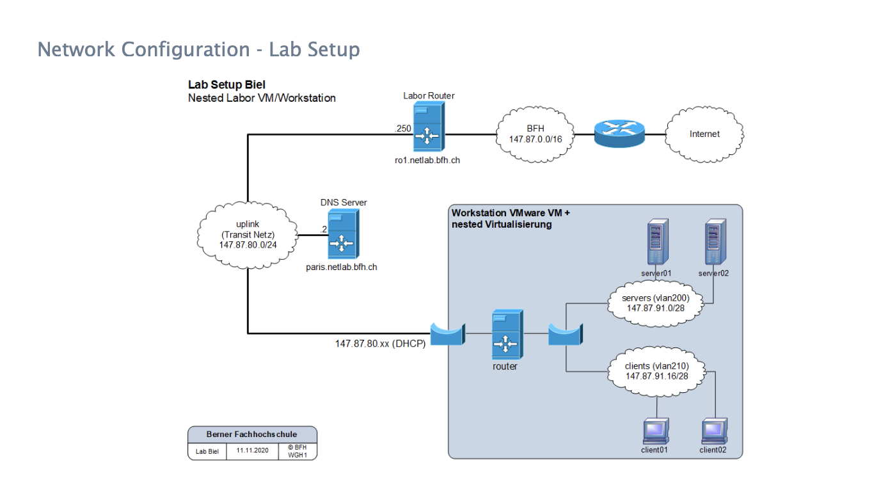


Zugangsdaten zum Lab:

username: netlab

password: hv$mast3r


[https://147.87.85.239](https://147.87.85.239/)!


Die Konfigurationen wurden wo möglich nicht via Webadmin sondern via
Konfigurations-Datei erstellt.  

# Exercise 1 Static Routing
## Task 2
### Aufgabe
Now start the "router" VM and configure the router interfaces according to the guidelines1 for your group:
"ens192" → uplink
"ens224" → servers
"ens256" → clients
See "S22.L2 – Lab Networks and Names" → "Routing and DHCP information". For the configuration you can use the administration tool "webmin".

### Erarbeitung

Die Interface-Konfiguration kann im File  `/etc/network/interfaces` vorgenommen werden: 


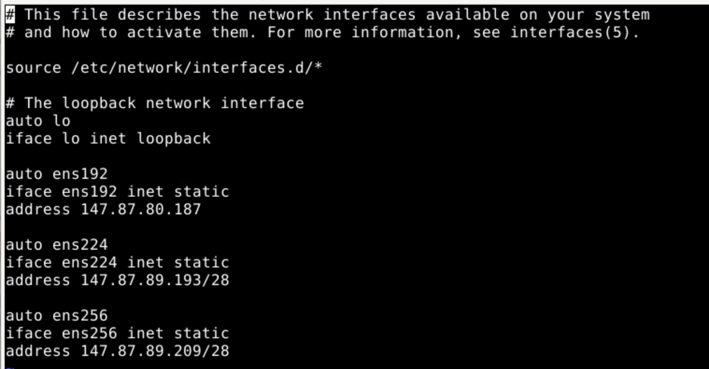


auto ens192 bedeutet, dass das Interface beim Befehl `ifup -a` automatisch 
aktiviert wird. (Task 3) 


## Task 4
### Aufgabe
Now configure the "Default Route" of your router according to the guidelines.

### Erarbeitung
Die "Default Route" kann mit folgendem Befehl zur Routing Tabelle hinzugefügt werden:
```
ip route add default via 147.87.80.250
```

## Task 5
### Aufgabe
In order for your router to resolve other machines by name, you must next configure its DNS resolver. (...)

### Erarbeitung

Für diesen Task wurde die Datei `resolv.conf` editiert


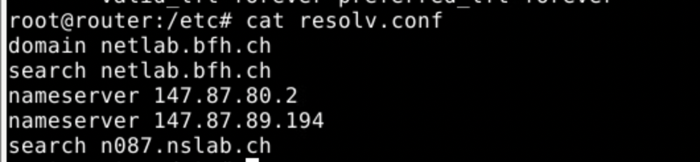


Die finale Konfiguration von `interfaces.d` sieht wir folgt aus:


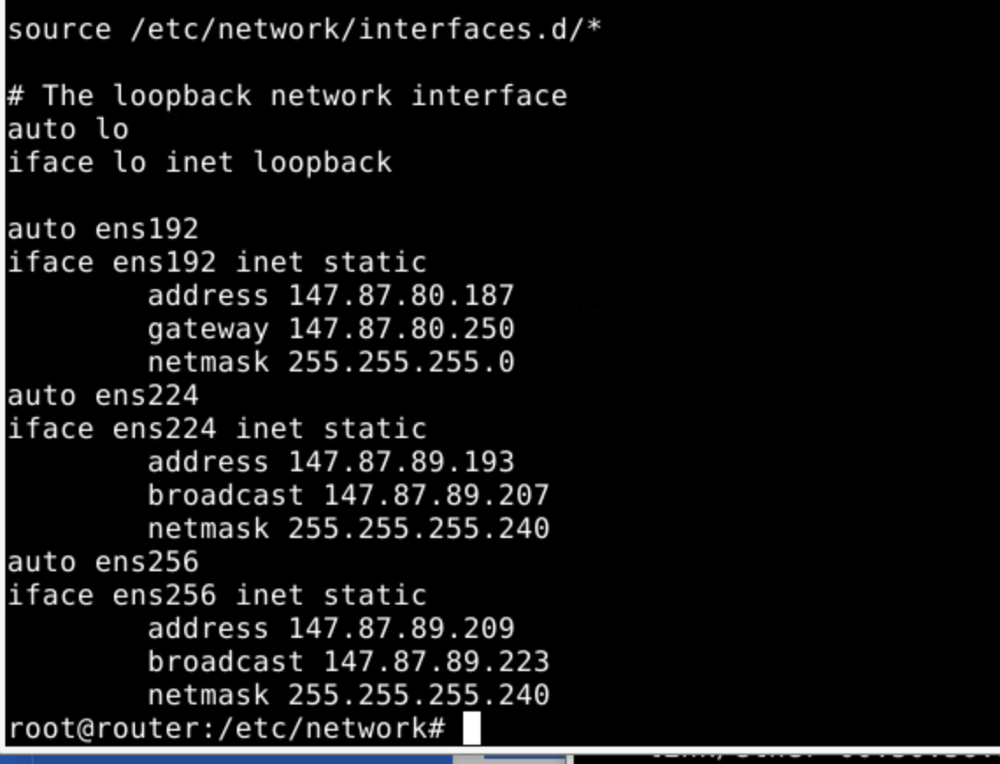


## Task 6
### Afgabe
Your DHCP server should start automatically after a reboot of the router.

### Erarbeitung
Auch nach einem Reboot kann der Router die Webseite based.cooking erreichen. 


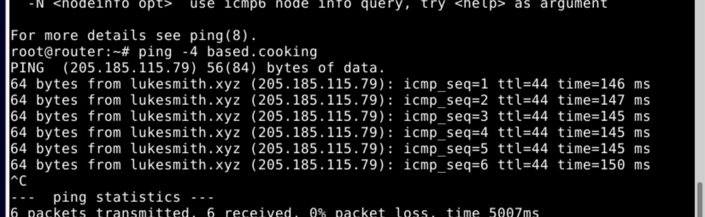


# Exercise 2 DHCP Server Configuration
In diesem Teil geht es darum, den DHCP-Server auf dem Router zu konfigurieren, 
so dass die Clients dynamische Adressen erhalten. 
## Task 2

### Aufgabe
Configure here the options "Domain name", "DNS servers" with the domain and the DNS servers according to "S22.L2 – Lab Networks and Names" → "DNS information") for your group.
Set the "Default lease time" and the "Maximum lease time" to small values (e.g. 200 and 300 secs) so that later on DHCP traffic is generated on your networks and you can record and analyze it with "wireshark".

### Erarbeitung

Die Einstellungen konnten im File `/etc/dhcp/dhcpd.conf` vorgenommen werden:


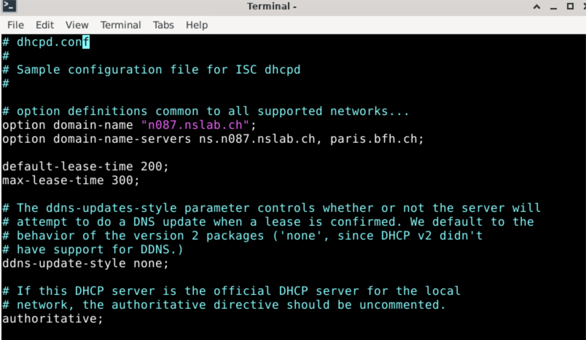


## Task 3
### Aufgabe
Restrict the DHCP communication to the interface "ens256" under (Edit Network Interface). Select the interface and click (Save).

### Erarbeitung
Die Restriktion, auf welchen Interfaces der Router DHCP-Adressen anbietet, kann in folgendem File getätigt werden:
> /etc/default/isc-dhcp-server

## task 4
### Aufgabe
Now add your "clients" subnet using "Add a new subnet":
Enter as "Subnet description" e.g. "clients".
Enter the "Network address" according to the guidelines for your "clients" network. Calculate the "Netmask" for your "clients" network and enter it.
Enter the address range (DHCP scope) for your "clients" network under "Address ranges". Now create the subnet with (Create).

### Erarbeitung

Hier hatten wir Probleme, dass der DHCP-Dienst nicht startete. Der Befehl `journalctl -xe` 
zeigt das Journal alles Systemd-Dienste. Dies hat uns aufgezeigt, dass unsere Konfiguraiton in
`/etc/dhcp/dhcpd.conf` fehlerhaft war. 
Nach einer Korrekur, konnte der Dienst gestart werden. 


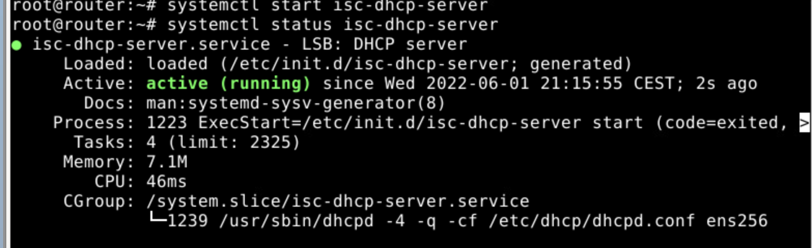


Ausschnitt aus `/etc/dhcp/dhcpd.conf`:

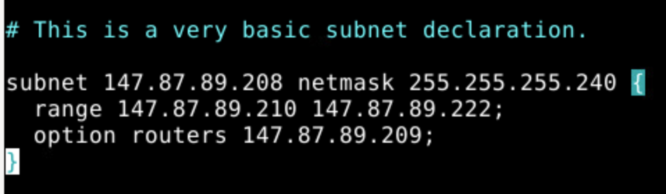

Nun können die Clients Adressen in der Rage 147.87.89.210  - 222 / 28 beziehen. 

# exercise 3
Im Exercise 3 geht es darum, die vorherigen Konfigurationen zu überprüfen.
Der Router wie auch der DHCP-Server funktionierten wie erwartet. 

## task 1
Der folgende Screenshot zeigt ein Wireshark ausschnitt, welcher ein DHCP-Lease Ablauf zeigt 
zwischen dem Router(DHCP-Server) 147.87.89.209 und dem Client
147.87.89.209


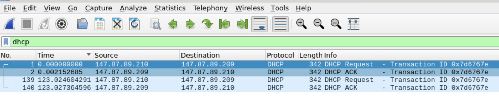


## task 2/3

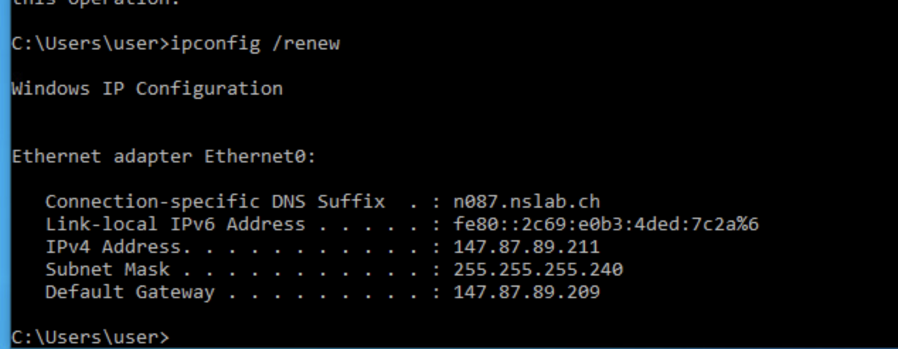


Der Client02 hat eine korrekte IP erhalten.
## task 4
Die Internet-Verbindung steht, diese kann normal genutzt werden.


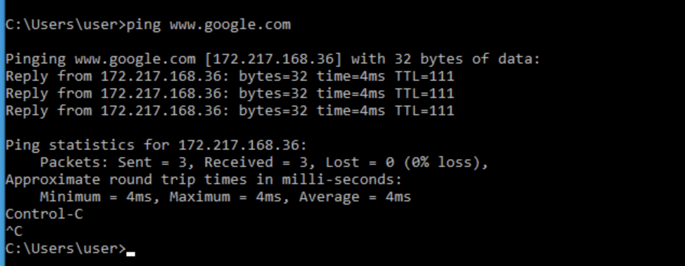
